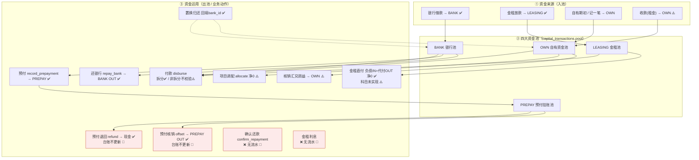
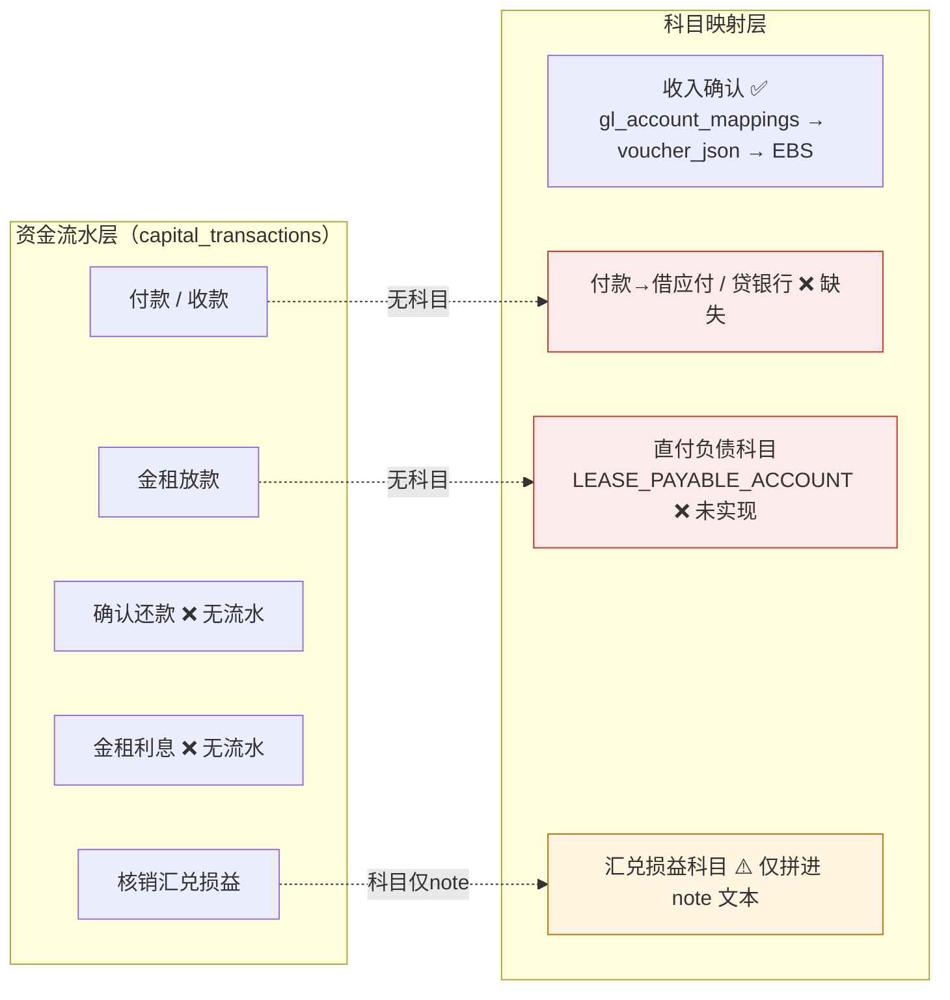
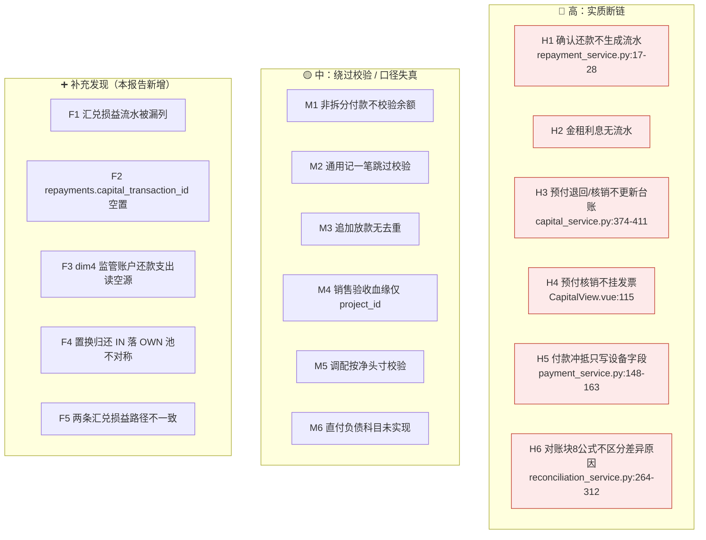

# SIEGPU 资金流转全景图（mermaid）

> 说明：✅=已勾稽，⚠️=口径/校验缺口，🔴=实质断链。虚线=间接/对冲归还。

## 图 1：资金流转全景（业务操作 → 四大资金池 → 资金运用）

```mermaid
flowchart TB
    subgraph SRC["① 资金来源（入池）"]
        S1["银行借款 → BANK ✅"]
        S2["金租放款 → LEASING ✅"]
        S3["自有期初 / 记一笔 → OWN"]
        S4["收款(租金) → OWN ⚠️"]
    end

    subgraph POOLS["② 四大资金池（capital_transactions.pool）"]
        OWN["OWN 自有资金池"]
        LEASING["LEASING 金租池"]
        BANK["BANK 银行池"]
        PREPAY["PREPAY 预付挂账池"]
    end

    subgraph ACT["③ 资金运用（出池 / 业务动作）"]
        A1["付款 disburse<br/>拆分✅ / 非拆分不校验⚠️"]
        A2["预付 record_prepayment → PREPAY ✅"]
        A3["预付退回 refund → 现金 ✅<br/>台账不更新 🔴"]
        A4["预付核销 offset → PREPAY OUT ✅<br/>台账不更新 🔴"]
        A5["金租直付 负债IN+代付OUT 净0 ✅<br/>科目未实现 ⚠️"]
        A6["置换归还 回填bank_id ✅"]
        A7["还银行 repay_bank → BANK OUT ✅"]
        A8["项目调配 allocate 净0 ⚠️"]
        A9["核销汇兑损益 → OWN ⚠️"]
        A10["确认还款 confirm_repayment<br/>❌ 无流水 🔴"]
        A11["金租利息<br/>❌ 无流水 🔴"]
    end

    S1 --> BANK
    S2 --> LEASING
    S3 --> OWN
    S4 --> OWN
    BANK --> A1
    BANK --> A2
    LEASING --> A1
    LEASING --> A5
    OWN --> A1
    OWN --> A8
    OWN --> A9
    A2 --> PREPAY
    PREPAY --> A3
    PREPAY --> A4
    A6 -.-> BANK
    A6 -.-> OWN
    BANK --> A7

    style A10 fill:#fdeaea,stroke:#c0392b
    style A11 fill:#fdeaea,stroke:#c0392b
    style A3 fill:#fdeaea,stroke:#c0392b
    style A4 fill:#fdeaea,stroke:#c0392b
```

## 图 2：会计科目映射缺口（资金流水层 ↔ 科目层）

```mermaid
flowchart LR
    subgraph FLOW["资金流水层（capital_transactions）"]
        F1["付款 / 收款"]
        F2["金租放款"]
        F3["确认还款 ❌ 无流水"]
        F4["金租利息 ❌ 无流水"]
        F5["核销汇兑损益"]
    end

    subgraph GL["科目映射层"]
        G1["收入确认 ✅<br/>gl_account_mappings → voucher_json → EBS"]
        G2["付款→借应付 / 贷银行 ❌ 缺失"]
        G3["直付负债科目<br/>LEASE_PAYABLE_ACCOUNT ❌ 未实现"]
        G4["汇兑损益科目 ⚠️ 仅拼进 note 文本"]
    end

    F1 -. "无科目" .-> G2
    F2 -. "无科目" .-> G3
    F5 -. "科目仅note" .-> G4

    style G2 fill:#fdeaea,stroke:#c0392b
    style G3 fill:#fdeaea,stroke:#c0392b
    style G4 fill:#fff4e0,stroke:#b9770e
```

## 图 3：断链风险地图（按严重度）

```mermaid
flowchart TB
    subgraph HIGH["🔴 高：实质断链"]
        H1["H1 确认还款不生成流水<br/>repayment_service.py:17-28"]
        H2["H2 金租利息无流水"]
        H3["H3 预付退回/核销不更新台账<br/>capital_service.py:374-411"]
        H4["H4 预付核销不挂发票<br/>CapitalView.vue:115"]
        H5["H5 付款冲抵只写设备字段<br/>payment_service.py:148-163"]
        H6["H6 对账块8公式不区分差异原因<br/>reconciliation_service.py:264-312"]
    end

    subgraph MID["🟡 中：绕过校验 / 口径失真"]
        M1["M1 非拆分付款不校验余额"]
        M2["M2 通用记一笔跳过校验"]
        M3["M3 追加放款无去重"]
        M4["M4 销售验收血缘仅 project_id"]
        M5["M5 调配按净头寸校验"]
        M6["M6 直付负债科目未实现"]
    end

    subgraph ADD["➕ 补充发现（本报告新增）"]
        F1["F1 汇兑损益流水被漏列"]
        F2["F2 repayments.capital_transaction_id 空置"]
        F3["F3 dim4 监管账户还款支出读空源"]
        F4["F4 置换归还 IN 落 OWN 池不对称"]
        F5["F5 两条汇兑损益路径不一致"]
    end

    style H1 fill:#fdeaea,stroke:#c0392b
    style H2 fill:#fdeaea,stroke:#c0392b
    style H3 fill:#fdeaea,stroke:#c0392b
    style H4 fill:#fdeaea,stroke:#c0392b
    style H5 fill:#fdeaea,stroke:#c0392b
    style H6 fill:#fdeaea,stroke:#c0392b
```
